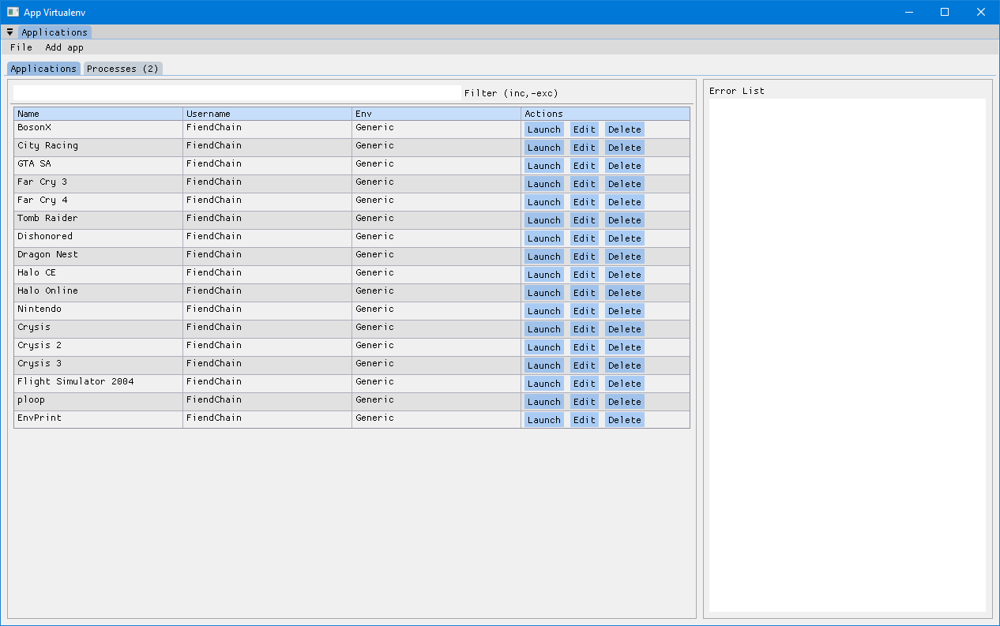
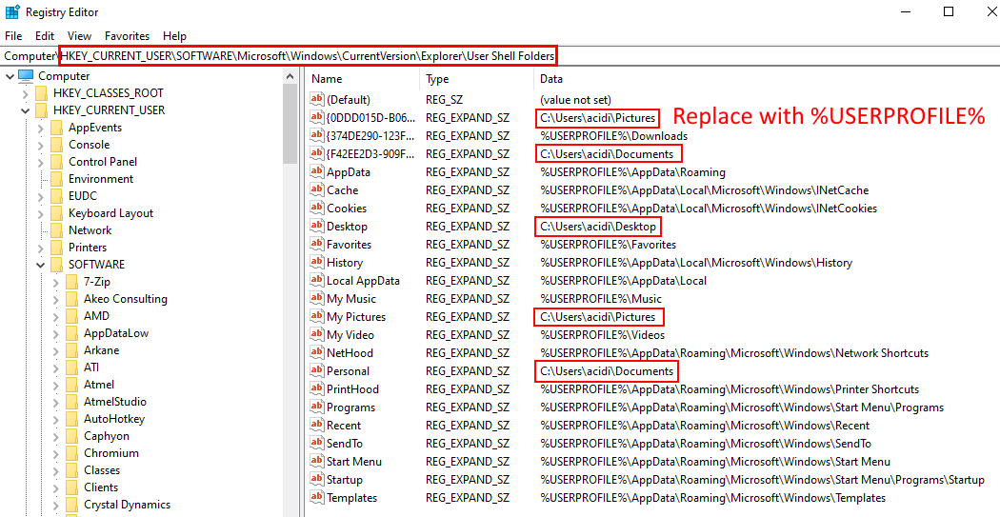

# Introduction
- Launches an application with a set of custom environment variables
- These environment variables correspond to a set of  directories which emulate window's directory structure
- Useful for containerising game or application save files

# Preview

# Additional Notes
Unfortunately some games read the Windows registry to get their environment variables which we cannot modify. 

Refer to [print_environment.cpp](src/print_environment.cpp) for how a program might read environment variables in different ways.

## Fix 1: Symbolic link
If you encounter a game which reads it from the Windows registry, the best alternative is to create a symbolic link to store the game files in a portable location.

The following windows command will create a symbolic link into a virtual environment. 

<code>mklink /J "%userprofile%/[our_game_directory]" "./envs/[our_env]/Users/[our_username]/[our_game_directory]"</code>. 

**NOTE**: Games may store their save and configuration files in other locations. <code>%userprofile%</code> or a subdirectory is usually the most common location.

- <code>%userprofile%/[our_game_directory]</code>
- <code>%userprofile%/Documents/[our_game_directory]</code>
- <code>%userprofile%/Documents/My Games/[our_game_directory]</code>
- <code>%userprofile%/Saved Games/[our_game_directory]</code>
- <code>%userprofile%/AppData/Roaming/[our_game_directory]</code>

This is not a definitive list and you may have to do your own research. 

## Fix 2: Registry editing
The function <code>SHGetKnownFolderPath</code> reads from the registry path <code>HKEY_CURRENT_USER\SOFTWARE\Microsoft\Windows\CurrentVersion\Explorer\User Shell Folders</code>. 

We can modify the values in there so they are based on environment variables instead of being hard coded to the current user directory.

**However this is not a particularly good fix**. The reason why only some of these registry entries are hard coded is probably because OneDrive sets these to point to the cloud drive. In the below screenshot OneDrive was enabled automatically by Windows. Then sync for those folders was disabled afterwards. This then resulted in some paths becoming hard coded. (*thanks Microsoft*)

In this screenshot we can replace <code>C:\Users\acidi</code> with <code>%USERPROFILE%</code> in the problematic folder paths. You can validate if the changes worked by running <code>print_environment.exe</code> inside the virtual environment.

If a folder is missing from the registry, you can manually add an entry. Refer to this [link](https://learn.microsoft.com/en-us/windows/win32/shell/knownfolderid) for the list of possible registry entries that can be added. (*some of these don't work*)

For example, the <code>Saved Games</code> folder can be specified with the following registry key for <code>FOLDERID_SavedGames</code>.
| Field | Value |
| --- | --- |
| Name | {4C5C32FF-BB9D-43b0-B5B4-2D72E54EAAA4} |
| Type | REG_EXPAND_SZ |
| Data | %USERPROFILE%\Saved Games |

**However this fix may not even work** since some of the folders from <code>SHGetKnownFolderPath</code> don't seem to be modifiable within the registry (*not that I have found*). Therefore use fix 1 (symbolic links) if this doesn't work.